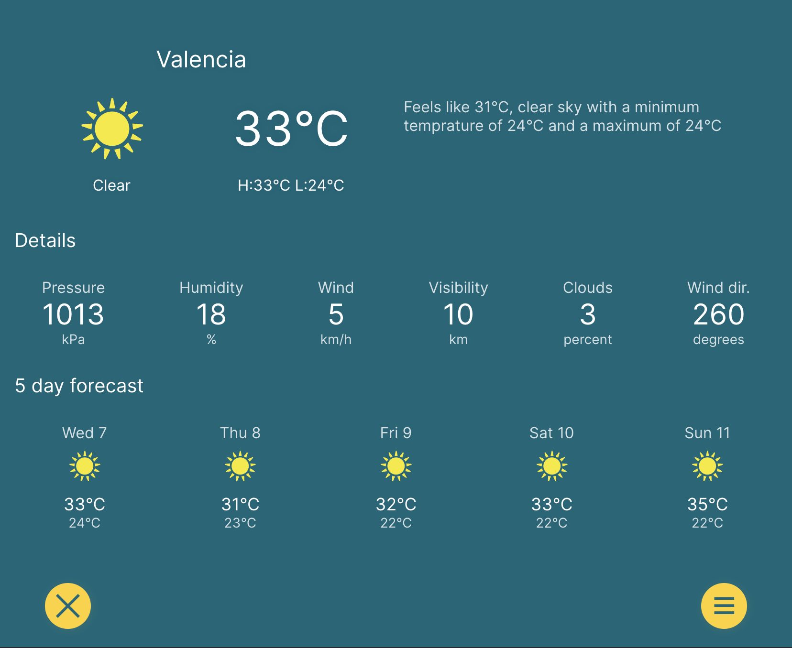

# Weather-TS

Simple, responsive weather app, created with [Create React App](https://github.com/facebook/create-react-app) and Typescript.

[Project Link](https://friendly-shortbread-c8c34c.netlify.app/)

## How It's Made:

Tech used: HTML, CSS, JavaScript, React, Typescript

Created with CRA Typescript template, based on a custom design. It's using browser LocalStorage to save user settings.
